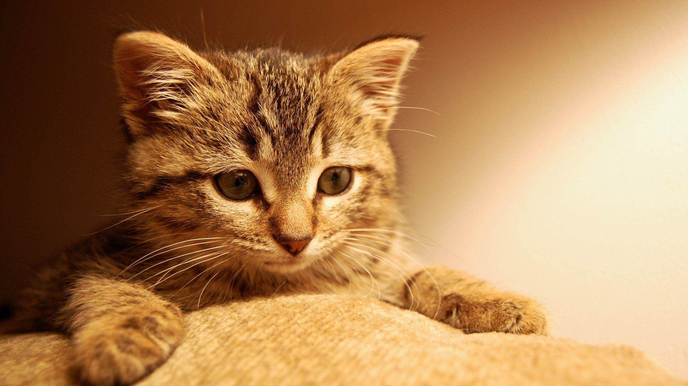
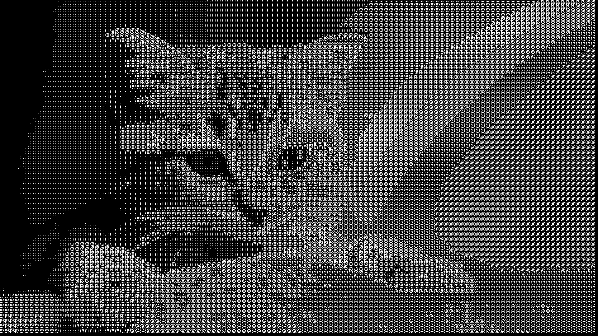

# ASCII art image converter

Convert any `.png` image to an ASCII version of itself. Inspired by [Acerola's
video](https://youtu.be/gg40RWiaHRY?si=BXRhRr5xB4rvH4QU) about ASCII art
shaders.



The image above is the result of the input



## Quick Start

```console
$ make
$ ./asciiart <input_img.png> <output_path.png>
```
