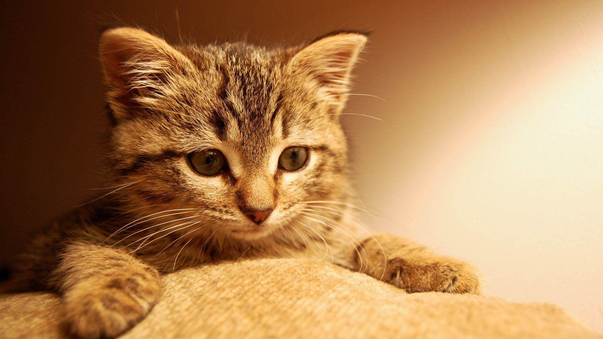
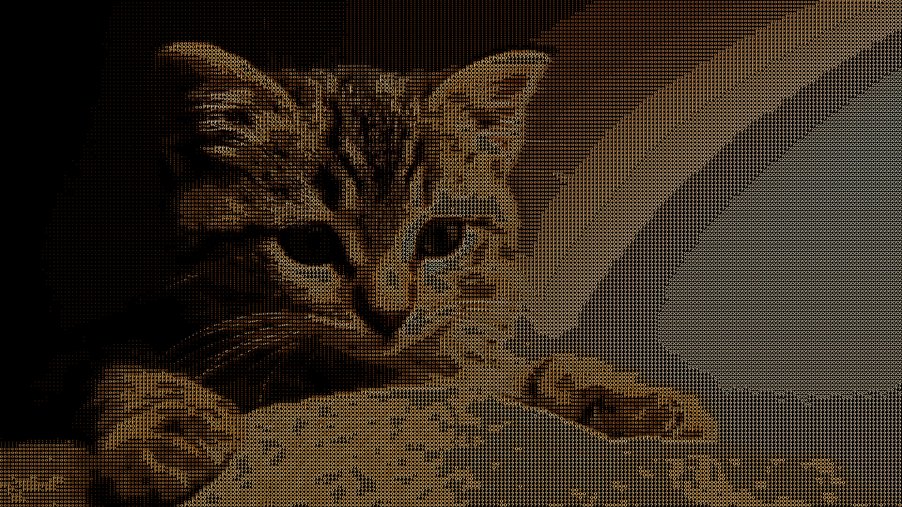
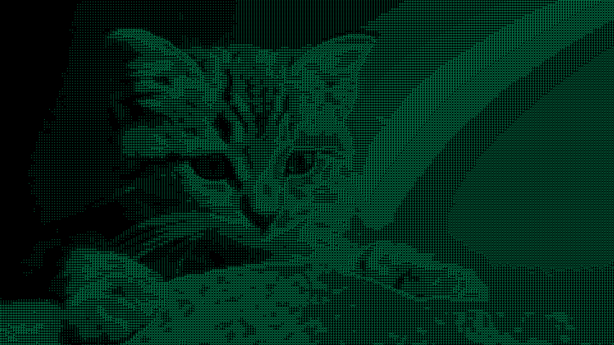

# ASCII art image converter

Convert any image to ASCII. Inspired by [Acerola's
video](https://youtu.be/gg40RWiaHRY?si=BXRhRr5xB4rvH4QU) about ASCII art
shaders.


The image above is the result of the input image



## Quick Start

```console
$ make
$ ./asciiart [options] <input_image_path> <output_image_path>
```

Currently the image is always saved in `png` format. Other formats may be added
in the future. The available options are:

| Option              | Description                                                           |
|---------------------|-----------------------------------------------------------------------|
| `--with-img-colors` | Use the image's original colors when rendering the ASCII characters   |
| `--with-color`      | Render the ASCII characters with the specified color (in RGBA format) |

## Examples





